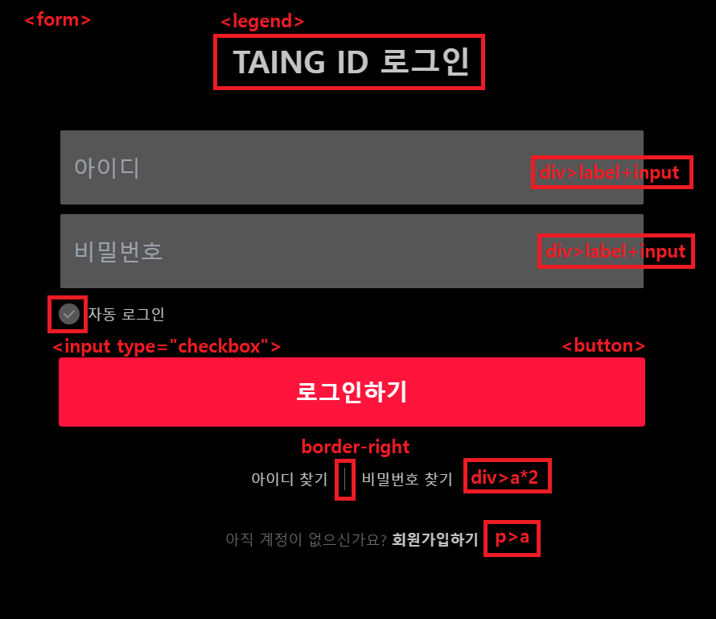
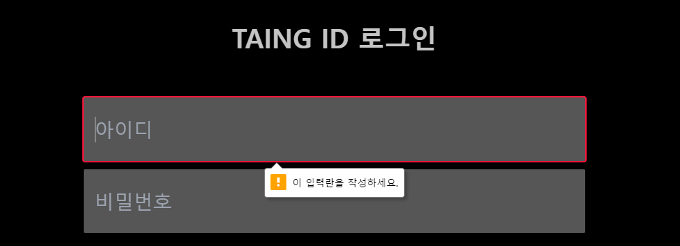
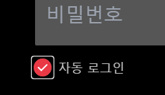
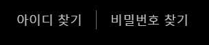
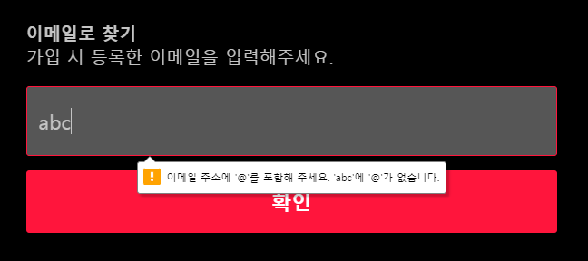
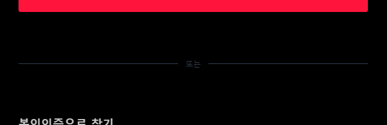

[ 멋쟁이 사자처럼 🦁  프론트엔드 스쿨 6기 | **HTML/CSS 팀프로젝트** ]

# 프로젝트 |&nbsp;&nbsp;  TAING
OTT 서비스 웹사이트를 반응형으로 구현합니다.

</br>


</br>

# 📄 목차

1. [팀 소개 | 13조 주민등록번호](#-팀-소개--13조-주민등록번호)
2. [개발 기간](#-개발-기간)
3. [기술 스택](#️-기술-스택)
4. [코딩 컨벤션](#-코딩-컨벤션)
5. [코드 리뷰](#ℹ️-코드-리뷰--메인-페이지)
   
   1. [메인 페이지](#ℹ️-코드-리뷰--메인-페이지)
   2. [로그인 관련 페이지](#ℹ️-코드-리뷰--로그인-관련-페이지)
6. [문법 검사](#-문법-검사)
7. [크로스 브라우징](#-크로스-브라우징)
8. [성능 최적화](#️-성능-최적화)

</br>

# 👥 팀 소개 |&nbsp;&nbsp; 13조 주민등록번호


| 프로필 | 이름 | GitHub |
|:-------:|:----:|:------:|
|      |   신승민(팀장)  | https://github.com/M-Moong  |
|      |   고명현 | https://github.com/gobeeisfree  |
|      |   김다인  | https://github.com/kimInDa  |
|      |   신현주  | https://github.com/shju0317  |

</br>

# ⏰ 개발 기간
#### 2023년 6월 22일
- 아이스 브레이킹

#### 2023년 6월 23일
- 기술 스택, 코딩 컨벤션, 접근성 체크리스트, 구현 페이지 범위 확정
- 개발 환경 셋팅
- 파트 배분

#### 2023년 6월 24일 ~ 6월 25일
- 개인 파트 구현  

#### 2023년 6월 26일
- 개인 파트 함께 디버깅  

#### 2023년 6월 27일
- 모두의 작업물 merge & 디버깅
- 구현 페이지 추가 & 작업
- README 작성  

#### 2023년 6월 28일
- 과제 제출

</br>

# 🛠️ 기술 스택

#### HTML

  


#### CSS

  

</br>


# 📖 코딩 컨벤션
>### CSS 프레임워크
>
>1. 주민등록번호조의 CSS 프레임워크는 Tailwind를 사용한다.

>### 네이밍 규칙
>
>1. 커스텀 CSS 클래스명은 **BEM 패턴**을 사용한다. (예시) `.form__input`
> 
>2. BEM패턴은 class에서 사용되는 방법론이므로 `id`나 `lable`, `name` 에서는 **카멜케이스**를 사용한다.  

>### 들여쓰기 규칙
>1. tab 간격은 2칸으로 한다.
>   
>2. 줄바꿈은 각자의 작업 방식에 따라 자유롭게 한다.
>   
>3. CSS 주석 방식은  한 줄이든 여러줄이든 `/*  */` 로 한다.
>   
>4. 따옴표는 `“ “` 겹따옴표를 사용한다.

   
</br>


# ℹ️ 코드 리뷰 |&nbsp;&nbsp; 메인 페이지
## 미디어 쿼리
```css
screens: {
  mobile: {'min': '320px', 'max': '767px'},
  tablet: {'min': '768px', 'max': '1199px'},
  desktop: {'min': '1200px', 'max': '1920px'}
}
```
## Head
```html
<title>TAING</title>
<meta name="description" content="타잉 오리지널 콘텐츠, 방송, 영화, 해외시리즈까지! 재미를 플레이해보세요.">
<link rel="shortcut icon" href="./images/favicon.ico" type="image/x-icon" />
```
- ``title``로 HTML 문서 전체의 제목을 나타냅니다.
- ``meta``의 ``content``속성으로 검색 엔진에서 해당 사이트의 정보를 표시하고 검색 될 수 있도록 합니다.
- ``link``의 ``shortcut icon``속성으로 파비콘을 설정하여 꾸며줍니다.

</br>

## Main
### header

- ``header``의 마크업 순서는 키보드 사용자와 스크린리더 사용자의 접근성을 고려하여 로고 제목, 검색, 네비게이션의 순서로 합니다.
- 시안의 순서로 바꾸어 주기 위해 ``header``에 ``flex``를 지정해주고 2번 ``ol``의 order를 2로 지정합니다.
- 1번 로고는 클릭 시 메인 페이지로 이동할 수 있어야 하므로 ``a``의 background-image로 넣어주고 ``aria-lable``로 대체 텍스트 "타잉"을 지정합니다. 페이지의 대제목이 될 수 있도록 ``h1``을 부모요소로 합니다.
  ```html 
  <h1>
    <a href="#" aria-label="타잉" class="bg-[url('/images/icon-logo.svg')] bg-no-repeat"></a>
  </h1>
- 2번 검색 아이콘은 ``button``의 background-image로 넣어주고 ``aria-lable``로 대체 텍스트 "검색"을 지정해 줍니다.
- 2번 프로필 사진은 클릭 시 마이페이지로 이동할 수 있도록 ``a``로 마크업 하고, background-image로 프로필 이미지를 넣어준 뒤 ``aria-lable``로 대체 텍스트 "마이페이지"를 지정해 줍니다.
- 3번 네비게이션은 모바일에서는 보이지 않아야 하므로 미디어 쿼리를 사용하여 
 

</br>


### article

</br>


### 티빙에서 꼭 봐야되는 콘텐츠

</br>


### Quick VOD

</br>


### 실시간 인기 프로그램

</br>


### 인기 LIVE 채널

</br>


### 오직 티빙에만 있어요

</br>


### 광고

</br>


### 이벤트

</br>


### footer

</br>


</br>

# ℹ️ 코드 리뷰 |&nbsp;&nbsp; 로그인 관련 페이지
## 로그인

- 로그인 페이지에는 서버로 전달되어야 하는 정보(아이디, 비밀번호 등)가 있기 때문에 ``form``태그로 마크업합니다.
- 아이디와 비밀번호 ``input``에 ``label``을 지정하여 어떤 입력란인지에 대한 정보를 제공합니다. ``label``에는 ``sr-only`` 클래스를 지정하여 스크린리더는 읽되 화면에는 보이지 않도록 합니다.
  ```html
    <!-- 아이디 -->
  <div class="w-[38vw] min-w-[288px] max-w-[732px] h-[5vw] min-h-[46px] max-h-[96px]">
    <label for="userId" class="sr-only">아이디</label>
    <input id="userId" name="userId" class=" form__input border p-4 outline-none rounded login__txt w-full h-full"
      type="text" placeholder="아이디" required />
    </div>
  ```
- ``border``를 지정하여 ``focus``를 받고 있는 요소를 알 수 있도록 합니다.
  ```css
  /* focus되면 빨간색 border 적용 */
  .form__input:focus{
  border: 2px solid #ff153c;
  }
  ``` 
- ``input``에 ``required``속성을 주어 아이디와 비밀번호를 입력하지 않고 버튼을 누를 경우 메시지를 띄우도록 합니다.
  
- ``background-image``로 체크이미지를 표현할 경우 해당 이미지에는 탭할 수 없습니다. 키보드로도 접근할 수 있도록 ``input``요소와 ``background-image``의 크기와 위치를 조정합니다.
  </br>
  
  ```html
    <!-- 자동 로그인 --> 
    <div class="flex relative mt-4 mb-10">
      <input
        class="auto-login appearance-none absolute top-1/2 -translate-y-1/2 w-[26px] h-[26px] checked:bg-checkbox-checked"
        type="checkbox" id="autoLogin" name="autoLogin" />
      <label for="autoLogin" class="pl-9 bg-checkbox-default bg-no-repeat bg-left text-lg">자동 로그인</label>
    </div>
  ```
- ``border-right``를 지정하여 `아이디 찾기`와 `비밀번호 찾기` 사이의 구분선을 표현합니다.


</br>

## 아이디 찾기
- ``input``을 ``type="email"``로 지정하여 이메일 형식으로 입력하지 않는 경우 메시지를 보여줍니다.
  
- ``before``와 ``after`` 가상요소를 사용하여 구분선을 표현합니다. 구분선이 가운데에 위치하도록 ``my-auto``를 지정합니다.
  ```html
  <!-- 구분선 -->
        <div class="flex w-[38vw] min-w-[288px] max-w-[732px] my-24 text-base text-gray-700 align-middle before:content-[''] before:flex-grow before:h-[1px] before:bg-gray-700 before:my-auto before:mr-4
        after:content-[''] after:flex-grow after:h-[1px] after:bg-gray-700 after:my-auto after:ml-4">또는</div>
  ```
  

</br>

## 비밀번호 찾기

</br>

## 회원가입

</br>


# 🔎 문법 검사

</br>

# 💻 크로스 브라우징

</br>

# ⚙️ 성능 최적화

</br>


